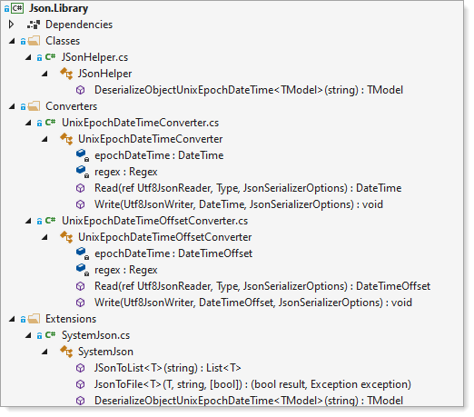
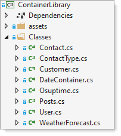
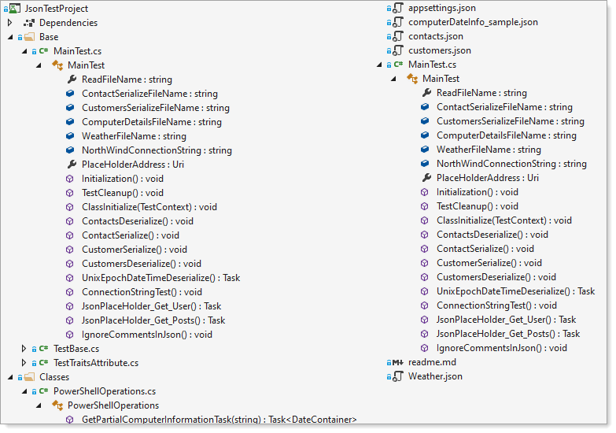

# About 

Working with Json using [System.Text.Json](https://docs.microsoft.com/en-us/dotnet/api/system.text.json?view=net-5.0) 

If you have been working with Json data for years most likely the choice library was NewtonSoft.Json installed from [NuGet package](https://www.nuget.org/packages/Newtonsoft.Json/).

Starting .NET 5.0, there is a new way to interact with Json from [System.Text.Json](https://docs.microsoft.com/en-us/dotnet/api/system.text.json?view=net-5.0).

The classes is not as mature as [Json.net](https://www.newtonsoft.com/json) although it’s still young and maturing and with that well worth trying out. Note the classes under System.Text.Json are typically faster than [Json.Net](https://www.newtonsoft.com/json) and the default serializer for ASP.NET Core.

# Learning to work with System.Text.Json

Typically there are three paths how a coder/developer approaches learning something new

1. Finding code samples on the web, try them out until one sample works, tries to adapt to their task and largely fails which then they go off and ask in a developer forum. If they get a solution nine times of ten they use the code without learning anything from it

1. Seek out documentation and code samples, integrate code into a project. If lucky all is good while when things don’t go as planned a) waste time tinkering with code b) ask in a forum like in the first path. Its 10/90 if they take time to learn where 90 is they don’t take time to learn.

1. Seek out documentation and code samples followed by either creating console or test projects along with mocked data to learn outside of a project. Once comfortable if the code is needed for more than one project some coders/programmers will create a class project which can be reused. There are different levels of reusability, hard code for specific classes or use [generics](https://docs.microsoft.com/en-us/dotnet/csharp/fundamentals/types/generics).


</br>

# Projects overview


For this post path three will be used. High level there is a class project for serializing/deserializing and another class project for concrete classes for  serializing/deserializing.

In the class project below there are simple/generic methods which are easy to use from code samples in an included unit test project.



The following class is for concrete classes for interating with Json data both locally and from the web.



The following unit test project for those experienced with testing will be easy to work with while those who never written unit test before may be confusing to understand although we will step through each aspect of not just serializing and deserializing Json data but also step through the anatomy of code flow in this unit test project.



## Unit test base classes

The unit test class MainTest is setup as a partial class so that in the root level there are only test methods while under the Base folder there are properties which are reused in more than one test method. Also, MainTest implements a class responsible for instantiating an instance of [TestContext class](https://docs.microsoft.com/en-us/dotnet/api/microsoft.visualstudio.testtools.unittesting.testcontext?view=visualstudiosdk-2019) which provides access to various pieces of information like test name which in the MainTest we can perform operations prior to a test method executing or after a test method runs.

In 

```csharp
[TestInitialize]
public void Initialization()
```

Code to test if a specific test method is going to execute the following code is generally used.

```csharp
if (TestContext.TestName == "ContactSerialize")
{
    if (File.Exists(ContactSerializeFileName))
    {
        File.Delete(ContactSerializeFileName);
    }
}
```

There is a flaw, if a programmer renames the test name then the above must also change. A better way is to use [nameof expression](https://docs.microsoft.com/en-us/dotnet/csharp/language-reference/operators/nameof). 

Now if the test method name changes performing a refactor/rename of the test method will be done below/

```csharp
if (TestContext.TestName == nameof(ContactSerialize))
{
    if (File.Exists(ContactSerializeFileName))
    {
        File.Delete(ContactSerializeFileName);
    }
}
```

As code grows for `Initialization` method it can be easy to not rename a test name when done as a string. Below shows how things can get complex in MainTest.cs

```csharp
[TestInitialize]
public void Initialization()
{

    if (TestContext.TestName == nameof(ContactsDeserialize) || TestContext.TestName == nameof(ContactSerialize))
    {
        ReadFileName = Path.Combine(AppDomain.CurrentDomain.BaseDirectory, "contacts.json");

        if (TestContext.TestName == nameof(ContactSerialize))
        {
            if (File.Exists(ContactSerializeFileName))
            {
                File.Delete(ContactSerializeFileName);
            }
        }

    }
    else if (TestContext.TestName == nameof(CustomersDeserialize) || TestContext.TestName == nameof(CustomerSerialize))
    {
        ReadFileName = Path.Combine(AppDomain.CurrentDomain.BaseDirectory, "customers.json");

        if (File.Exists(CustomersSerializeFileName))
        {
            File.Delete(CustomersSerializeFileName);
        }
    }

}
```

There are several properties setup for use in test methods which point to json files for serializing an deserializing.

```csharp
/// <summary>
/// File to read for <see cref="Contact"/> test
/// </summary>
public string ContactSerializeFileName = Path.Combine(AppDomain.CurrentDomain.BaseDirectory, "ContactsSerialized.json");

/// <summary>
/// File to read for <see cref="Customer"/> test
/// </summary>
public string CustomersSerializeFileName = Path.Combine(AppDomain.CurrentDomain.BaseDirectory, "CustomersSerialized.json");

/// <summary>
/// File used for PowerShell operations
/// </summary>
public string ComputerDetailsFileName = Path.Combine(AppDomain.CurrentDomain.BaseDirectory, "computerDateInfo.json");
public string WeatherFileName = Path.Combine(AppDomain.CurrentDomain.BaseDirectory, "Weather.json");
```


## Serialing/deserializing test methods

TODO


